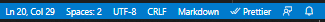
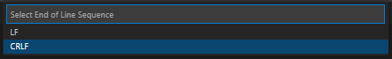

# Docker healtchcheck script

You need to know about you'r containers health! (It's useful in production 😄)

<p style="text-align: center"></p>

# About

It's for automatic healthcheck, when you'r containers up; script do few retrais in some secs or min interval

# How to use

(YOU) Build images, play with settings shell script and run it:

```sh
  docker-compose up
```

⚠ Sometimes would be error with shell script and in console you would seen `unexpected end of file`; If you don't want to see it, save shell script in `LF` mode not `CRLF`
💻in VScode it would be here 👉  and you need to change param here 👉 
